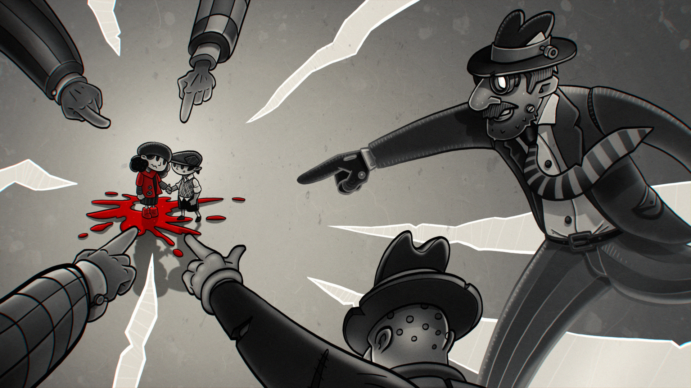
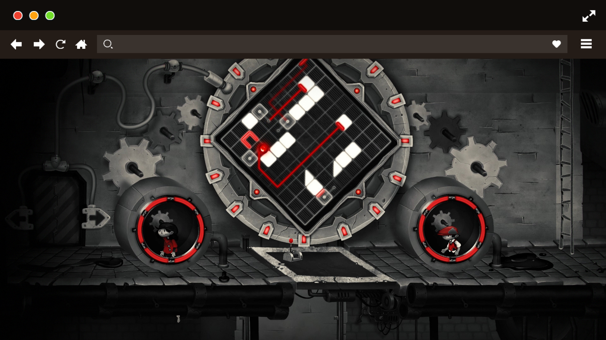
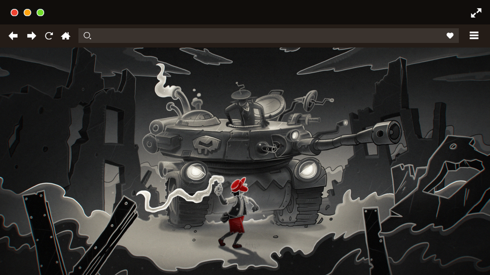

"My Memory of Us" es un videojuego indie que narra la historia de dos niños en un mundo inspirado por la ocupación nazi. A través de una estética de cuento y mecánicas cooperativas, el juego explora la amistad, la resiliencia y la esperanza en tiempos de guerra.

<figure>
  
  <figcaption>My Memory of Us</figcaption>
</figure>

El apartado visual en blanco, negro y rojo es impactante, y la narrativa logra emocionar sin necesidad de palabras. Cada puzle y desafío refuerza el vínculo entre los protagonistas, haciendo que el jugador se involucre emocionalmente en su viaje.

<figure>
  
  <figcaption>My Memory of Us</figcaption>
</figure>

Es una experiencia corta pero intensa, ideal para quienes buscan juegos con mensaje y corazón. "My Memory of Us" demuestra que los videojuegos pueden contar historias profundas y conmovedoras.

<figure>
  
  <figcaption>My Memory of Us</figcaption>
</figure>
