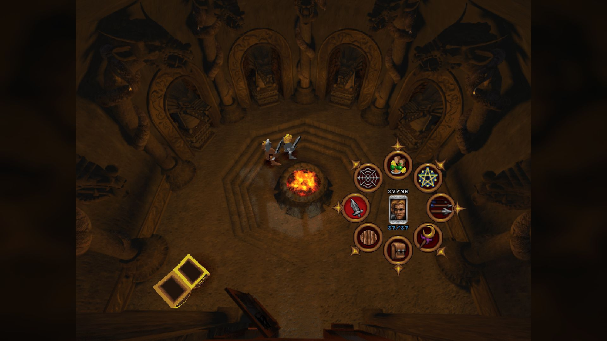
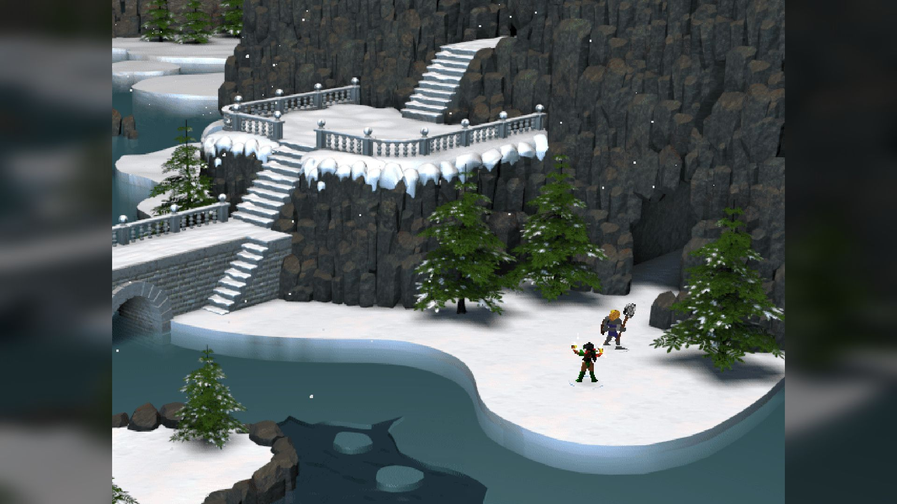
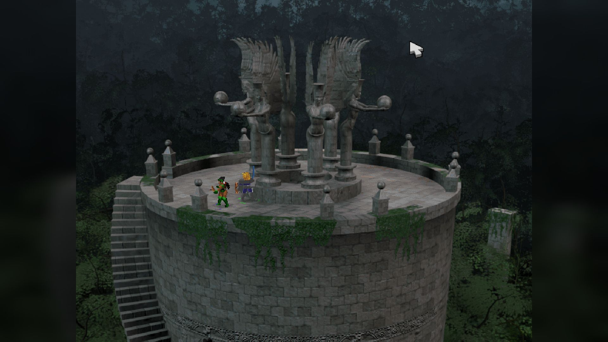
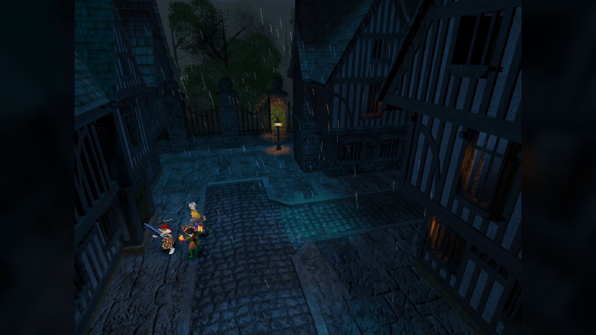
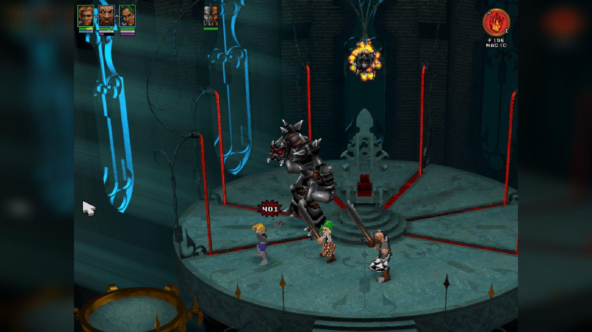

"Silver" es un juego de rol y acción desarrollado por Infogrames y lanzado para PC en 1999. Destaca por su ambientación fantástica, su sistema de combate en tiempo real y una historia épica llena de personajes memorables.

<figure>
  
  <figcaption>Silver</figcaption>
</figure>

El jugador asume el papel de David, un héroe que debe rescatar a su esposa y enfrentarse al malvado Silver, quien ha sumido el mundo en la oscuridad. A lo largo de la aventura, se exploran escenarios variados, se resuelven puzles y se reclutan aliados con habilidades únicas.

<figure>
  
  <figcaption>Silver</figcaption>
</figure>

El apartado visual, con gráficos pre-renderizados y animaciones cuidadas, crea una atmósfera envolvente. La banda sonora orquestal y los diálogos doblados refuerzan la inmersión en la narrativa.

<figure>
  
  <figcaption>Silver</figcaption>
</figure>

Silver es una joya olvidada que combina acción, exploración y rol clásico, ideal para quienes buscan una experiencia retro diferente y llena de encanto.

<figure>
  
  <figcaption>Silver</figcaption>
</figure>

<figure>
  
  <figcaption>Silver</figcaption>
</figure>
