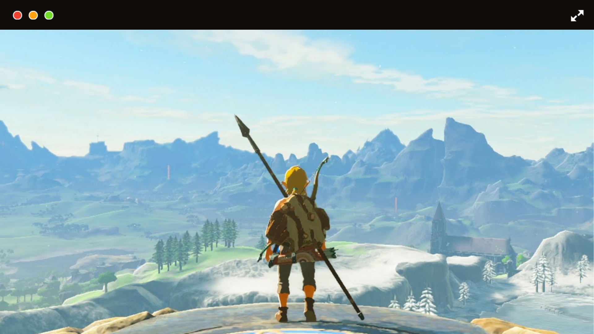

Desde que Shigeru Miyamoto y Takashi Tezuka crearon el primer _The Legend of Zelda_ en 1986, la saga no ha dejado de reinventarse. Aquello que empezó como una aventura de exploración en 8 bits se ha convertido en uno de los pilares de la historia de los videojuegos.

## Los orígenes

El primer juego sorprendió por su libertad: podías explorar el mundo de Hyrule en cualquier orden y resolver los dungeons a tu ritmo. Una propuesta radical para la época que sentó las bases del género de las aventuras de acción.

<figure>
  
  <figcaption>The Legend of Zelda: Breath of the Wild</figcaption>
</figure>

## La edad de oro: Ocarina of Time

Con el salto a las 3D en 1998, _Ocarina of Time_ redefinió lo que podía ser un videojuego. Su sistema de combate con Z-targeting, su narrativa épica y su mundo cohesionado lo convirtieron en una referencia que sigue vigente hoy.

## El giro radical: Breath of the Wild

En 2017, _Breath of the Wild_ lo volvió a cambiar todo. Nintendo abandonó las convenciones de la propia saga para crear un mundo abierto donde la física, la química y la creatividad del jugador son las protagonistas. El resultado fue una obra maestra que marcó una nueva era.
