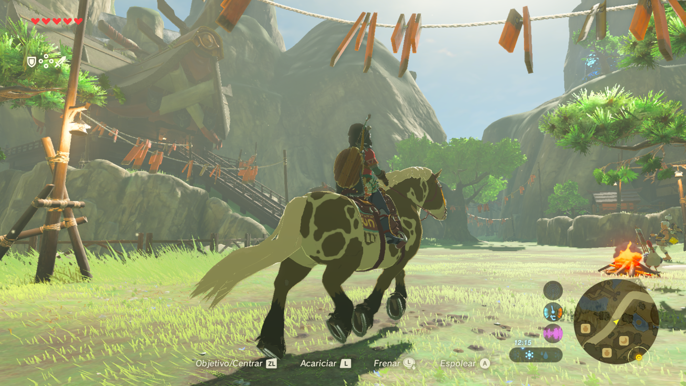
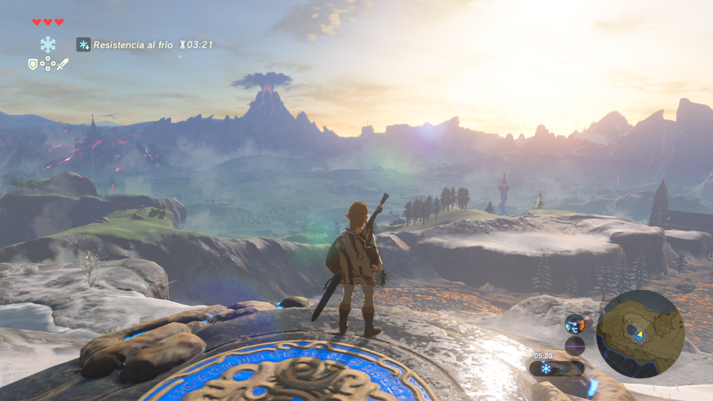

import YoutubeEmbed from '@/components/youtube-embed.astro'

Desde el primer momento en que Link despierta en la Meseta de los Albores, supe que estaba ante algo especial. Breath of the Wild no solo redefine la saga Zelda, sino que eleva el estándar de los juegos de mundo abierto. La libertad para explorar, escalar cualquier montaña y perderse en los rincones de Hyrule es simplemente adictiva.

### Secretos en cada rincón

Lo que más me sorprendió fue la cantidad de secretos y detalles ocultos. Desde los santuarios ingeniosos hasta los misteriosos Kologs, siempre hay algo nuevo por descubrir. Recuerdo la primera vez que encontré un dragón surcando el cielo al amanecer: fue un momento mágico que solo este juego puede ofrecer.

<figure>
  
  <figcaption>The Legend of Zelda: Breath of the Wild</figcaption>
</figure>

### Supervivencia y creatividad

La mecánica de supervivencia añade una capa de profundidad inesperada. Cocinar, gestionar el clima y experimentar con las físicas del juego me llevó a situaciones tan divertidas como desafiantes. ¿Quién diría que lanzar una espada metálica durante una tormenta podría ser una estrategia viable?

<figure>
  
  <figcaption>The Legend of Zelda: Breath of the Wild</figcaption>
</figure>

### Una historia épica y emotiva

Aunque la narrativa es más sutil que en otros Zeldas, los recuerdos dispersos y los personajes entrañables logran construir una historia épica y emotiva. La relación entre Link y Zelda, así como el misterio de la calamidad, me mantuvieron enganchado hasta el final.

<YoutubeEmbed
  src="https://youtu.be/ofH5ptn5w-A"
  caption="The Legend of Zelda: Breath of the Wild"
/>

## Conclusión

Breath of the Wild es una obra maestra que invita a la exploración y la experimentación. Si aún no lo has jugado, te recomiendo sumergirte en Hyrule y dejarte sorprender por sus maravillas.
